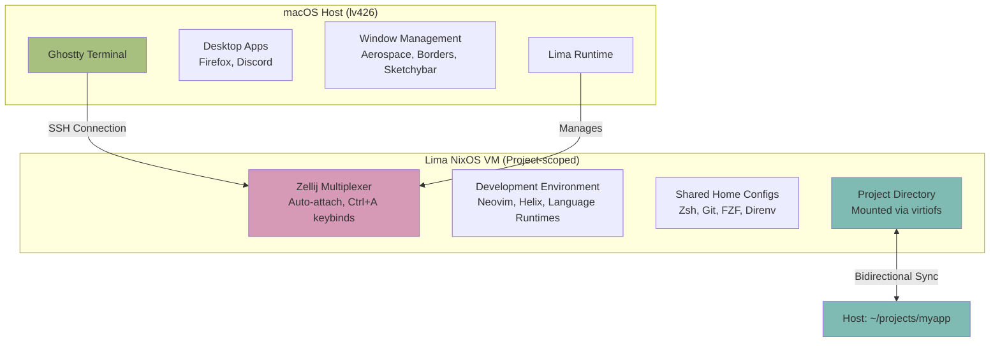
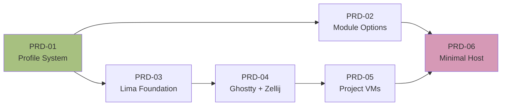

# System Composability Refactor - Overview

## Vision

Transform the sysinit configuration from a monolithic system into a Unix philosophy-aligned, composable architecture with disposable development environments.

## Goals

1. **Unix Philosophy Alignment**
   - Modularity: Each module self-contained with own options
   - Composability: Mix profiles to create different environments
   - Do one thing well: Clear separation of concerns
   - Minimal coupling: Modules declare explicit dependencies

2. **Disposable Development Environments**
   - Project-scoped Lima NixOS VMs
   - Reproducible via flake configurations
   - Fast startup with pre-built images
   - Isolated from host system

3. **Minimal Host**
   - macOS runs only desktop apps and GUI
   - Ghostty terminal connects to Lima VMs
   - All development happens inside VMs
   - Clean, maintainable host system

## Architecture Overview



## PRD Structure

Each PRD follows this structure:
- **Overview**: What and why
- **Scope**: What's included and excluded
- **Technical Design**: How it works
- **Acceptance Criteria**: Explicit pass/fail conditions
- **Testing**: How to verify
- **Rollback**: How to undo if needed

## Implementation Phases



1. [PRD-01: Profile System](./01-profile-system.md) - Composable profile architecture
2. [PRD-02: Module Options](./02-module-options.md) - Decentralized options system
3. [PRD-03: Lima Foundation](./03-lima-foundation.md) - Base NixOS VM configuration
4. [PRD-04: Ghostty + Zellij](./04-ghostty-zellij.md) - Terminal and multiplexer setup
5. [PRD-05: Project VMs](./05-project-vms.md) - Project-scoped VM management
6. [PRD-06: Minimal Host](./06-minimal-host.md) - Strip host to essentials

## Non-Goals

- Not creating container-based environments (using VMs instead)
- Not changing theme system (works fine, leave as-is)
- Not refactoring LLM configs (works fine, leave as-is)

## Success Metrics

- macOS host has <50 packages (down from ~200+)
- Lima VM starts in <2 minutes
- `sysinit-vm shell` drops into working dev environment
- All existing workflows still functional
- No manual steps required for new projects

## Dependencies

Each PRD has clear dependencies noted in its document. The critical path is:

```
PRD-01 → PRD-02 → PRD-06
PRD-01 → PRD-03 → PRD-04 → PRD-05 → PRD-06
```

All PRDs can be worked on sequentially or with some parallelization after PRD-01.

## Migration Strategy

- Incremental changes, one PRD at a time
- Test after each phase
- Git tags at safe points for rollback
- Keep existing system working throughout
- Final cutover only after all phases tested
