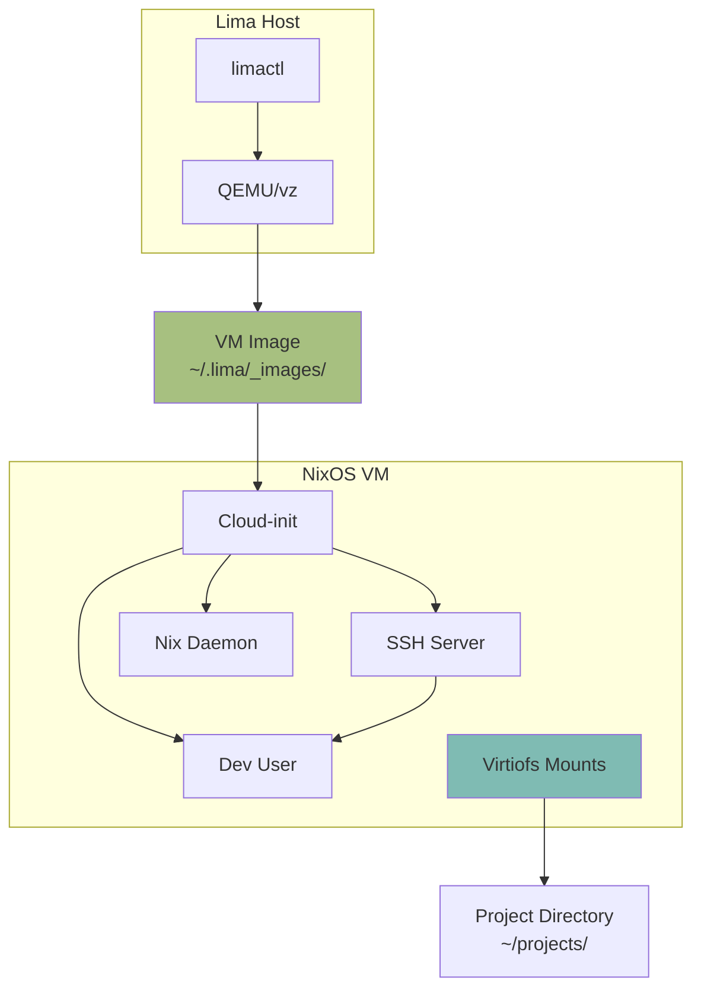

# PRD-03: Lima Foundation

## Overview

Create base NixOS VM configuration for Lima that provides a foundation for disposable development environments. This includes the VM system configuration, image building infrastructure, and basic Lima template.

## Problem Statement

Development work currently happens on the macOS host, causing:
- Host pollution with language runtimes and dev tools
- Difficulty isolating project dependencies
- No easy way to create disposable environments
- Can't test configurations in isolated VMs

## Proposed Solution

Build NixOS VM images designed for Lima that contain minimal system configuration with hooks for home-manager to provide dev tools. Create build scripts and templates for easy VM creation.

## Scope

### In Scope
- NixOS VM base configuration (lima-base.nix)
- VM image building via nix build
- Build script (hack/build-lima-image)
- Basic Lima template (lima/templates/minimal.yaml)
- nixosConfigurations for lima-minimal
- Documentation for image building

### Out of Scope
- Full development environment (handled in PRD-04)
- Zellij configuration (handled in PRD-04)
- Project-scoped VMs (handled in PRD-05)
- Home-manager integration (handled in PRD-04)

## Technical Design

### NixOS VM Architecture



### File Structure

```
modules/system/nixos/vm/
├── lima-base.nix          # Base VM configuration
└── cloud-init.nix         # Cloud-init setup (optional)

lima/
├── templates/
│   ├── minimal.yaml       # Basic VM template
│   └── _common.yaml       # Shared Lima settings
└── README.md              # Lima usage docs

hack/
└── build-lima-image       # Image build script
```

### Lima Base Configuration

```nix
# modules/system/nixos/vm/lima-base.nix
{ config, pkgs, lib, modulesPath, ... }:

{
  imports = [
    (modulesPath + "/profiles/qemu-guest.nix")
  ];
  
  # Boot configuration
  boot.loader.grub.enable = false;
  boot.initrd.availableKernelModules = [ "virtio_pci" "virtio_scsi" "ahci" "sd_mod" ];
  boot.kernelModules = [ "virtiofs" ];
  
  # Filesystem
  fileSystems."/" = {
    device = "/dev/sda";
    fsType = "ext4";
  };
  
  # Networking
  networking = {
    hostName = "lima-nixos";
    useDHCP = true;
    firewall.enable = false;  # Lima networking is isolated
  };
  
  # SSH for Lima connection
  services.openssh = {
    enable = true;
    settings = {
      PasswordAuthentication = false;
      PermitRootLogin = "no";
    };
  };
  
  # Cloud-init for Lima provisioning
  services.cloud-init = {
    enable = true;
    network.enable = true;
  };
  
  # Dev user
  users.users.dev = {
    isNormalUser = true;
    extraGroups = [ "wheel" "networkmanager" ];
    shell = pkgs.zsh;
    openssh.authorizedKeys.keys = [];  # Populated by Lima
  };
  
  # Passwordless sudo for dev user
  security.sudo.wheelNeedsPassword = false;
  
  # Nix settings
  nix.settings = {
    experimental-features = [ "nix-command" "flakes" ];
    trusted-users = [ "root" "dev" ];
    auto-optimise-store = true;
  };
  
  # Essential system packages
  environment.systemPackages = with pkgs; [
    vim
    git
    curl
    wget
    htop
  ];
  
  # Enable zsh system-wide
  programs.zsh.enable = true;
  
  system.stateVersion = "25.05";
}
```

### Flake Integration

```nix
# flake/outputs.nix (additions)
{
  nixosConfigurations = {
    # ... existing arrakis ...
    
    lima-minimal = nixpkgs.lib.nixosSystem {
      system = "aarch64-linux";
      modules = [
        ./modules/system/nixos/vm/lima-base.nix
        {
          # Minimal additions for testing
          environment.systemPackages = [ pkgs.neofetch ];
        }
      ];
    };
  };
  
  # Make images buildable
  packages.aarch64-darwin = {
    lima-minimal-image = 
      nixosConfigurations.lima-minimal.config.system.build.image;
  };
}
```

### Build Script

```bash
#!/usr/bin/env bash
# hack/build-lima-image

set -euo pipefail

IMAGE_NAME="${1:-lima-minimal}"
LIMA_IMAGES="$HOME/.lima/_images"

echo "Building $IMAGE_NAME image..."
nix build ".#packages.aarch64-darwin.${IMAGE_NAME}-image" --show-trace

mkdir -p "$LIMA_IMAGES"
IMAGE_DATE=$(date +%Y%m%d-%H%M%S)
DEST="$LIMA_IMAGES/sysinit-${IMAGE_NAME}-${IMAGE_DATE}.qcow2"

cp -L result/nixos.qcow2 "$DEST"
ln -sf "$DEST" "$LIMA_IMAGES/sysinit-${IMAGE_NAME}-latest.qcow2"

echo "Image built: $DEST"
echo "Symlink: $LIMA_IMAGES/sysinit-${IMAGE_NAME}-latest.qcow2"
```

### Lima Template

```yaml
# lima/templates/minimal.yaml
vmType: "vz"
os: "Linux"
arch: "aarch64"

cpus: 2
memory: "4GiB"
disk: "20GiB"

images:
  - location: "~/.lima/_images/sysinit-lima-minimal-latest.qcow2"
    arch: "aarch64"

mounts:
  - location: "~/.ssh"
    writable: false
  - location: "~/projects"
    writable: true
    9p:
      securityModel: "none"
      cache: "mmap"

ssh:
  localPort: 0
  loadDotSSHPubKeys: true

provision:
  - mode: system
    script: |
      #!/bin/sh
      set -eux
      echo "Lima NixOS VM provisioned"
      uname -a

probes:
  - description: "SSH is ready"
    script: |
      #!/bin/bash
      ssh -o ConnectTimeout=3 127.0.0.1 true
    hint: "Waiting for SSH to be ready..."
```

## Acceptance Criteria

All criteria must pass for PRD completion.

**File Structure**
- `modules/system/nixos/vm/lima-base.nix` exists and is valid Nix
- `lima/templates/minimal.yaml` exists with valid Lima config
- `hack/build-lima-image` exists and is executable
- `lima/README.md` documents image building and usage

**Flake Integration**
- `nixosConfigurations.lima-minimal` added to flake outputs
- `packages.aarch64-darwin.lima-minimal-image` buildable
- `nix flake check` passes
- `task nix:validate` passes

**Image Building**
- `nix build .#packages.aarch64-darwin.lima-minimal-image` succeeds
- `./hack/build-lima-image lima-minimal` completes without errors
- Image file created at `~/.lima/_images/sysinit-lima-minimal-*.qcow2`
- Symlink created at `~/.lima/_images/sysinit-lima-minimal-latest.qcow2`
- Image size reasonable (< 2GB)

**VM Functionality**
- `limactl start --name=test-minimal lima/templates/minimal.yaml` succeeds
- VM boots within 2 minutes
- `limactl shell test-minimal` connects successfully
- Inside VM: `uname -a` shows Linux
- Inside VM: `which vim git curl wget` all found
- Inside VM: `nix --version` shows nix command available
- Inside VM: `whoami` shows "dev"
- Inside VM: `sudo echo test` works (passwordless)
- SSH keys from host visible: `ls ~/.ssh/` shows keys
- Project directory mounted: `ls ~/projects` shows host contents
- `limactl stop test-minimal` succeeds
- `limactl delete test-minimal` succeeds

**Documentation**
- `lima/README.md` contains build instructions
- `lima/README.md` contains usage examples
- Build script has help text

## Testing

### Build Test

```bash
# Validate flake
task nix:validate
nix flake check

# Build image
./hack/build-lima-image lima-minimal

# Verify image exists
ls -lh ~/.lima/_images/sysinit-lima-minimal-*.qcow2
file ~/.lima/_images/sysinit-lima-minimal-latest.qcow2
```

### VM Test

```bash
# Start VM
limactl start --name=test-minimal lima/templates/minimal.yaml

# Wait for boot (check status)
limactl list
# Should show: test-minimal  Running

# Connect
limactl shell test-minimal

# Inside VM - test system
uname -a                    # Should show Linux
whoami                      # Should show: dev
nix --version               # Should work
which vim git curl          # All found

# Test sudo
sudo echo "sudo works"      # No password prompt

# Test SSH keys
ls ~/.ssh/                  # Keys from host visible

# Test mounts
cd ~/projects
pwd                         # Should show /home/dev/projects
# Create file
echo "test" > test-lima.txt
exit

# On host - verify file sync
cat ~/projects/test-lima.txt  # Should show: test
rm ~/projects/test-lima.txt

# Cleanup
limactl stop test-minimal
limactl delete test-minimal
```

### Regression Test

```bash
# Ensure existing configs still work
task nix:build:lv426
task nix:build:arrakis
```

## Rollback

### If Build Fails

```bash
# No system changes, safe to debug
# Fix nix errors and rebuild
nix build .#packages.aarch64-darwin.lima-minimal-image --show-trace
```

### If VM Doesn't Boot

```bash
# Delete VM
limactl delete test-minimal

# Check Lima logs
cat ~/.lima/test-minimal/ha.log
cat ~/.lima/test-minimal/serial.log

# Rebuild image with fixes
./hack/build-lima-image lima-minimal
```

### Nuclear Option

```bash
# Remove all Lima VMs
limactl list | tail -n +2 | awk '{print $1}' | xargs -n1 limactl delete -f

# Remove images
rm -rf ~/.lima/_images/sysinit-*

# Revert code
git revert HEAD
```

## Dependencies

**Blocks**: PRD-04, PRD-05
**Blocked By**: PRD-01

The profile system must exist first. This PRD provides the foundation for Ghostty+Zellij integration and project-scoped VMs.

## Notes

- VM uses vz (Apple Virtualization.framework) for better performance on macOS
- Cloud-init handles initial provisioning
- SSH keys automatically shared from host
- Virtiofs provides fast file sharing
- Image includes only system packages, home-manager tools added in PRD-04
- lima-minimal is intentionally bare, full dev environment comes in PRD-04
