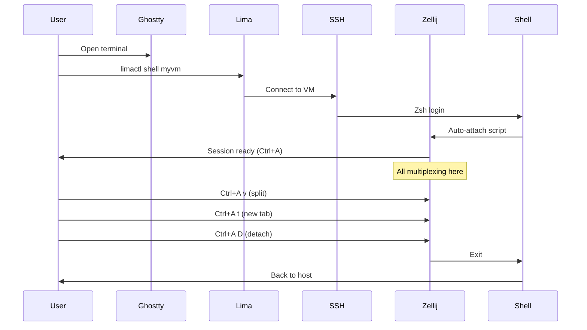

# PRD-04: Ghostty + Zellij Integration

## Overview

Restore and integrate Ghostty terminal emulator and Zellij multiplexer with auto-attach functionality for Lima VMs. Ghostty runs on macOS host as a "dumb terminal" while Zellij provides all multiplexing inside VMs.

## Problem Statement

Current setup uses WezTerm with complex Lua configuration for tabs, panes, and multiplexing. For the Lima VM workflow, we need:
- Simpler terminal on host (Ghostty)
- Multiplexing inside VMs (Zellij)
- Auto-attach when connecting to VMs
- Same keybindings as current WezTerm setup (Ctrl+A prefix)

## Proposed Solution

Deploy Ghostty on macOS host with minimal configuration, restore Zellij configuration from git history with auto-attach support, and integrate both into the full development VM image (lima-dev).

## Scope

### In Scope
- Restore Ghostty configuration from git history
- Restore Zellij configuration from git history (with plugins)
- Configure Zellij auto-attach for SSH connections
- Create lima-dev nixosConfiguration with full dev environment
- Build lima-dev image with all dev tools
- Update profiles to include Ghostty and Zellij

### Out of Scope
- Modifying WezTerm configuration (keeping for now)
- Creating project-scoped VMs (handled in PRD-05)
- Minimal host implementation (handled in PRD-06)
- Custom Zellij layouts (using defaults)

## Technical Design

### Architecture



### File Structure

```
modules/
├── desktop/home/
│   └── ghostty/
│       ├── default.nix          # Ghostty config
│       └── lima-integration.sh  # Auto-detect Lima VMs
│
└── dev/home/shell/
    └── zellij/
        ├── default.nix          # Zellij config
        ├── auto-attach.sh       # Auto-attach script
        └── plugins/             # Zellij plugins (optional)

profiles/
├── dev-full.nix                 # Include Zellij
└── host-minimal.nix             # Include Ghostty
```

### Ghostty Configuration

```nix
# modules/desktop/home/ghostty/default.nix
{ config, lib, pkgs, ... }:

{
  stylix.targets.ghostty.enable = true;
  
  programs.ghostty = {
    enable = true;
    
    settings = {
      # Minimal config - Ghostty as dumb terminal
      # Zellij handles all multiplexing
      
      # Theme from stylix
      # (automatically configured)
      
      # Vim-style scrollback (optional)
      keybind = [
        "alt+v=activate_key_table:vim"
        
        # Vim key table
        "vim/"
        "vim/j=scroll_page_lines:1"
        "vim/k=scroll_page_lines:-1"
        "vim/ctrl+d=scroll_page_down"
        "vim/ctrl+u=scroll_page_up"
        "vim/g>g=scroll_to_top"
        "vim/shift+g=scroll_to_bottom"
        "vim/slash=start_search"
        "vim/n=navigate_search:next"
        "vim/escape=deactivate_key_table"
        "vim/q=deactivate_key_table"
        "vim/catch_all=ignore"
      ];
    };
  };
  
  # Shell integration for Lima detection
  home.file.".config/zsh/extras/lima-detect.sh".source = ./lima-integration.sh;
}
```

### Lima Integration Script

```bash
# modules/desktop/home/ghostty/lima-integration.sh
# Auto-detect Lima VMs in current project

lima_auto_detect() {
  if [[ -f "$PWD/.lima/config.yaml" ]]; then
    local vm_name=$(basename "$PWD")-dev
    echo "Lima VM detected: $vm_name"
    echo "Connect: limactl shell $vm_name"
    echo ""
  fi
}

# Run on directory change
chpwd_functions+=(lima_auto_detect)
```

### Zellij Configuration

```nix
# modules/dev/home/shell/zellij/default.nix
{ config, lib, pkgs, values, ... }:

let
  themes = import ../../../../shared/lib/theme { inherit lib; };
  zellijThemeName = themes.getAppTheme "zellij" 
    values.theme.colorscheme 
    values.theme.variant;
  
  configContent = ''
    // Zellij Configuration
    default_shell "zsh"
    copy_clipboard "primary"
    copy_command "pbcopy"
    mouse_mode true
    simplified_ui true
    auto_layout true
    scroll_buffer_size 100000
    copy_on_select true
    pane_frames false
    
    theme "${zellijThemeName}"
    
    // Plugins
    load_plugins "session-manager" "zjstatus" "vim-zellij-navigator"
    
    plugins {
        session-manager {
            location "zellij:session-manager"
        }
        zjstatus {
            location "https://github.com/dj95/zjstatus/releases/latest/download/zjstatus.wasm"
        }
        vim-zellij-navigator {
            location "https://github.com/hiasr/vim-zellij-navigator/releases/latest/download/vim-zellij-navigator.wasm"
        }
    }
    
    // Keybindings (Ctrl+A prefix, matching WezTerm)
    keybinds clear-defaults=true {
        normal {
            // Mode switching
            bind "Ctrl a a" { SwitchToMode "locked"; }
            bind "Ctrl a r" { SwitchToMode "resize"; }
            bind "Ctrl a S" { SwitchToMode "scroll"; }
            bind "Ctrl a /" { SwitchToMode "search"; }
            
            // Pane navigation (vim keys)
            bind "Ctrl a h" {
                MessagePlugin "vim-zellij-navigator" {
                    name "move_focus";
                    payload "left";
                };
            }
            bind "Ctrl a j" {
                MessagePlugin "vim-zellij-navigator" {
                    name "move_focus";
                    payload "down";
                };
            }
            bind "Ctrl a k" {
                MessagePlugin "vim-zellij-navigator" {
                    name "move_focus";
                    payload "up";
                };
            }
            bind "Ctrl a l" {
                MessagePlugin "vim-zellij-navigator" {
                    name "move_focus";
                    payload "right";
                };
            }
            
            // Pane splitting
            bind "Ctrl a v" { NewPane "right"; }
            bind "Ctrl a s" { NewPane "down"; }
            bind "Ctrl a w" { CloseFocus; }
            
            // Tab management
            bind "Ctrl a t" { NewTab; }
            bind "Ctrl a 1" { GoToTab 1; }
            bind "Ctrl a 2" { GoToTab 2; }
            bind "Ctrl a 3" { GoToTab 3; }
            bind "Ctrl a 4" { GoToTab 4; }
            bind "Ctrl a 5" { GoToTab 5; }
            bind "Ctrl a 6" { GoToTab 6; }
            
            // Session management
            bind "Ctrl a D" { Detach; }
            bind "Ctrl a q" { Quit; }
            bind "Ctrl a f" { ToggleFocusFullscreen; }
            bind "Ctrl a k" { Clear; }
        }
        
        resize {
            bind "h" { Resize "Increase left"; }
            bind "j" { Resize "Increase down"; }
            bind "k" { Resize "Increase up"; }
            bind "l" { Resize "Increase right"; }
            bind "Esc" { SwitchToMode "normal"; }
        }
        
        scroll {
            bind "j" { ScrollDown; }
            bind "k" { ScrollUp; }
            bind "Ctrl d" { HalfPageScrollDown; }
            bind "Ctrl u" { HalfPageScrollUp; }
            bind "g" { ScrollToTop; }
            bind "G" { ScrollToBottom; }
            bind "/" { SwitchToMode "search"; }
            bind "Esc" { SwitchToMode "normal"; }
        }
        
        search {
            bind "n" { Search "down"; }
            bind "N" { Search "up"; }
            bind "Esc" { SwitchToMode "normal"; }
        }
        
        locked {
            bind "Ctrl a Esc" { SwitchToMode "normal"; }
        }
    }
  '';
  
  autoAttachScript = pkgs.writeShellScript "zellij-auto-attach" ''
    # Auto-attach to Zellij when connecting via SSH (Lima)
    if [[ -z "$ZELLIJ" ]] && [[ -n "$SSH_CONNECTION" || "$TERM_PROGRAM" == "ghostty" ]]; then
      SESSION_NAME="''${ZELLIJ_SESSION:-$(basename "$PWD")}"
      
      if ${pkgs.zellij}/bin/zellij list-sessions 2>/dev/null | grep -q "^$SESSION_NAME"; then
        exec ${pkgs.zellij}/bin/zellij attach "$SESSION_NAME"
      else
        exec ${pkgs.zellij}/bin/zellij attach --create "$SESSION_NAME"
      fi
    fi
  '';
in
{
  home.packages = [ pkgs.zellij ];
  
  xdg.configFile."zellij/config.kdl".text = configContent;
  
  # Auto-attach via zsh
  programs.zsh.initExtra = lib.mkAfter ''
    # Auto-attach to Zellij when connecting via SSH
    source ${autoAttachScript}
  '';
}
```

### Lima Dev Configuration

```nix
# Add to flake/outputs.nix
lima-dev = nixpkgs.lib.nixosSystem {
  system = "aarch64-linux";
  modules = [
    ./modules/system/nixos/vm/lima-base.nix
    home-manager.nixosModules.home-manager
    {
      home-manager.useGlobalPkgs = true;
      home-manager.useUserPackages = true;
      home-manager.users.dev = {
        imports = [
          profiles.dev-full  # Includes Zellij
        ];
      };
    }
  ];
};

# Add to packages
packages.aarch64-darwin.lima-dev-image = 
  nixosConfigurations.lima-dev.config.system.build.image;
```

### Updated Profiles

```nix
# profiles/dev-full.nix
{ pkgs, ... }:
{
  imports = [
    ./base.nix
    ../modules/dev/home/editors/neovim
    ../modules/dev/home/shell/zellij    # NEW
    ../modules/dev/home/shell/zsh
    ../modules/dev/home/vcs/git
    # ... other dev tools
  ];
  
  home.packages = with pkgs; [
    nodejs python3 rustc cargo go
    ripgrep fd bat eza delta
    ast-grep
  ];
}

# profiles/host-minimal.nix (update)
home-manager.users.rshnbhatia = {
  imports = [
    ../modules/desktop/home/ghostty  # NEW
    ../modules/desktop/home/firefox
    ../modules/dev/home/shell/zsh
    ../modules/dev/home/vcs/git
  ];
};
```

## Acceptance Criteria

All criteria must pass for PRD completion.

**Ghostty Configuration**
- `modules/desktop/home/ghostty/default.nix` exists
- Ghostty enabled via home-manager
- Stylix integration configured
- Vim keybindings configured
- Lima detection script exists

**Zellij Configuration**
- `modules/dev/home/shell/zellij/default.nix` exists
- Zellij config written to `~/.config/zellij/config.kdl`
- Ctrl+A keybindings configured
- Auto-attach script integrated with zsh
- Plugins configured (session-manager, zjstatus, vim-zellij-navigator)

**Lima Dev Image**
- `nixosConfigurations.lima-dev` added to flake
- `packages.aarch64-darwin.lima-dev-image` buildable
- `./hack/build-lima-image lima-dev` succeeds
- Image includes all dev tools (neovim, git, node, python, rust, go)
- Image includes Zellij

**Build Validation**
- `task nix:validate` passes
- `nix flake check` succeeds
- `task nix:build:lv426` succeeds
- Ghostty package installed on host

**System Functionality**
- `task nix:refresh:lv426` applies successfully
- Ghostty launches on macOS
- Ghostty displays with correct theme (everforest)
- Can type in Ghostty terminal

**VM Integration**
- Lima-dev VM starts successfully
- `limactl shell <vm>` connects
- Zellij auto-attaches immediately
- Zellij session shows correct theme
- Ctrl+A t creates new tab
- Ctrl+A v creates vertical split
- Ctrl+A h/j/k/l navigates panes
- Ctrl+A D detaches from Zellij
- Can reattach to same session
- Neovim available in VM: `which nvim` found
- Language runtimes available: `node --version`, `python3 --version`, `rustc --version`

## Testing

### Ghostty Test (on macOS host)

```bash
# Apply config
task nix:refresh:lv426

# Launch Ghostty
open -a Ghostty

# Test functionality
# - Terminal should open
# - Theme should be everforest dark-soft
# - Can type commands
# - Alt+V enters vim mode (test j/k scrolling)

# Test Lima detection
cd ~/projects
mkdir test-project && cd test-project
mkdir .lima
# Should see: "Lima VM detected" message
cd .. && rm -rf test-project
```

### Zellij Test (in Lima VM)

```bash
# Build lima-dev image
./hack/build-lima-image lima-dev

# Create test VM
cat > /tmp/test-dev.yaml <<EOF
vmType: "vz"
cpus: 4
memory: "8GiB"
images:
  - location: "~/.lima/_images/sysinit-lima-dev-latest.qcow2"
    arch: "aarch64"
mounts:
  - location: "~/.ssh"
    writable: false
  - location: "~/projects"
    writable: true
ssh:
  loadDotSSHPubKeys: true
EOF

# Start VM
limactl start --name=test-dev /tmp/test-dev.yaml

# Connect - should auto-attach to Zellij
limactl shell test-dev

# Inside Zellij:
# Test keybindings:
# - Ctrl+A t       # New tab (should work)
# - Ctrl+A v       # Vertical split (should work)
# - Ctrl+A h/l     # Navigate panes (should work)
# - Ctrl+A D       # Detach
# Back at host shell

# Reattach
limactl shell test-dev
# Should reconnect to same session

# Inside Zellij again:
# Test tools
which nvim          # Found
which node          # Found
which python3       # Found
which rustc         # Found
nvim --version      # Works
node --version      # Works

# Exit
# Ctrl+A q (quit Zellij)
exit

# Cleanup
limactl delete test-dev
rm /tmp/test-dev.yaml
```

### Integration Test

```bash
# Full workflow test
cd ~/projects
mkdir integration-test && cd integration-test

# Create Lima config (will be automated in PRD-05)
cat > .lima/config.yaml <<EOF
vmType: "vz"
cpus: 4
memory: "8GiB"
images:
  - location: "~/.lima/_images/sysinit-lima-dev-latest.qcow2"
    arch: "aarch64"
mounts:
  - location: "~/.ssh"
    writable: false
  - location: "$PWD"
    writable: true
env:
  ZELLIJ_SESSION: "integration-test"
ssh:
  loadDotSSHPubKeys: true
EOF

# Start
limactl start --name=integration-test .lima/config.yaml

# Connect (auto-attach to Zellij with session name "integration-test")
limactl shell integration-test

# Should be in Zellij immediately
# Create test file
echo "test" > test.txt
# Ctrl+A D to detach
exit

# Verify file on host
cat ~/projects/integration-test/test.txt  # Shows "test"

# Cleanup
limactl delete integration-test
cd .. && rm -rf integration-test
```

## Rollback

### If Ghostty Breaks

```bash
# Remove Ghostty from profile
# Edit profiles/host-minimal.nix, remove ghostty import
task nix:refresh:lv426
# Continue using WezTerm
```

### If Zellij Breaks

```bash
# SSH to VM without Zellij auto-attach
limactl shell <vm>
# Then manually: export ZELLIJ=1 before connecting
# This prevents auto-attach loop
```

### If Lima Dev Image Doesn't Build

```bash
# Use lima-minimal from PRD-03
# Debug build errors:
nix build .#packages.aarch64-darwin.lima-dev-image --show-trace
```

### Full Rollback

```bash
git revert HEAD
task nix:refresh:lv426
# Back to WezTerm
```

## Dependencies

**Blocks**: PRD-05, PRD-06
**Blocked By**: PRD-01, PRD-03

Requires profile system and Lima foundation. This PRD provides the terminal and multiplexer that will be used in project VMs and minimal host.

## Notes

- Ghostty configuration is intentionally minimal
- All multiplexing happens in Zellij inside VMs
- Zellij keybindings mirror existing WezTerm muscle memory
- Auto-attach script prevents nested Zellij sessions
- Plugins are optional but provide better UX
- Session names can be customized via ZELLIJ_SESSION env var
- WezTerm remains installed for now, removed in PRD-06
