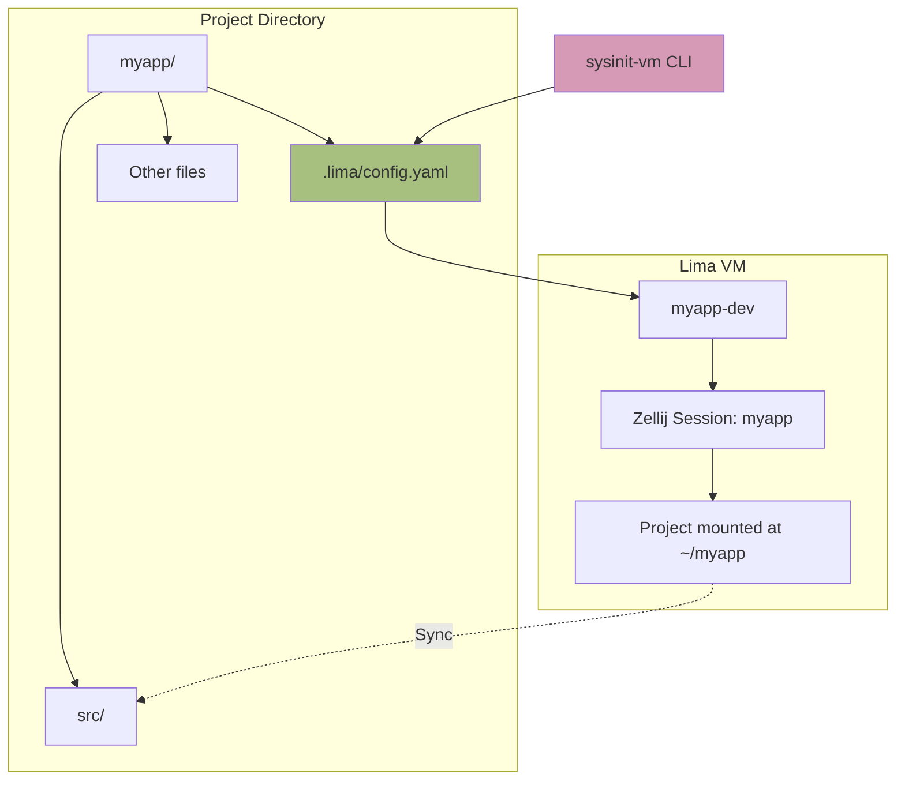

# PRD-05: Project-Scoped VM Management

## Overview

Create project-scoped Lima VM management system where each project can define its own VM configuration, and a CLI tool (`sysinit-vm`) automates the VM lifecycle (init, start, shell, destroy).

## Problem Statement

After PRD-04, we can create Lima VMs manually, but the workflow is cumbersome:
- Must manually create Lima YAML configs
- Must remember VM names
- No standardized project structure
- No automation for common tasks
- Hard to discover which projects have VMs

## Proposed Solution

Implement a project-scoped VM system where:
- Each project has `.lima/config.yaml` defining its VM
- VM name derived from project directory name
- `sysinit-vm` CLI automates all VM operations
- Templates provide consistent VM configs
- Integration with Taskfile for easy access

## Scope

### In Scope
- Lima template directory structure
- Project-scoped Lima config template
- `sysinit-vm` CLI tool (bash script)
- VM lifecycle commands (init, start, stop, shell, destroy)
- Taskfile integration
- Documentation

### Out of Scope
- Minimal host implementation (handled in PRD-06)
- Advanced Lima features (snapshots, etc.)
- Multi-VM orchestration
- CI/CD integration

## Technical Design

### Project Structure



### File Structure

```
lima/
├── templates/
│   ├── dev.yaml              # Full dev environment template
│   ├── minimal.yaml          # Minimal template (from PRD-03)
│   ├── project-template.yaml # Template for .lima/config.yaml
│   └── _common.yaml          # Shared settings
├── scripts/
│   └── (future automation)
└── README.md                 # Usage documentation

hack/
└── sysinit-vm                # Main CLI tool

# In each project:
~/projects/myapp/
├── .lima/
│   ├── config.yaml           # Project-specific VM config
│   └── .gitignore            # Ignore VM state files
└── (project files)
```

### Lima Templates

```yaml
# lima/templates/project-template.yaml
# Template for .lima/config.yaml in projects
vmType: "vz"
os: "Linux"
arch: "aarch64"

cpus: 4
memory: "8GiB"
disk: "50GiB"

images:
  - location: "~/.lima/_images/sysinit-lima-dev-latest.qcow2"
    arch: "aarch64"

mounts:
  - location: "~/.ssh"
    writable: false
    # SSH keys mounted read-only
  - location: "{{PROJECT_DIR}}"
    writable: true
    9p:
      securityModel: "none"
      cache: "mmap"

# Set environment variables
env:
  PROJECT_NAME: "{{PROJECT_NAME}}"
  ZELLIJ_SESSION: "{{PROJECT_NAME}}"

# Port forwarding for dev servers
portForwards:
  - guestPort: 3000
    hostPort: 3000
  - guestPort: 8080
    hostPort: 8080
  - guestPort: 5173
    hostPort: 5173

ssh:
  localPort: 0
  loadDotSSHPubKeys: true

provision:
  - mode: system
    script: |
      #!/bin/sh
      set -eux
      echo "Lima VM provisioned for {{PROJECT_NAME}}"
      
  - mode: user
    script: |
      #!/bin/bash
      cd ~/{{PROJECT_NAME}}
      echo "Working directory: $(pwd)"

probes:
  - description: "SSH is ready"
    script: |
      #!/bin/bash
      ssh -o ConnectTimeout=3 127.0.0.1 true
```

### sysinit-vm CLI

```bash
#!/usr/bin/env bash
# hack/sysinit-vm
# Manage project-scoped Lima development VMs

set -euo pipefail

SCRIPT_DIR="$(cd "$(dirname "${BASH_SOURCE[0]}")" && pwd)"
REPO_ROOT="$(cd "$SCRIPT_DIR/.." && pwd)"
LIMA_TEMPLATES="$REPO_ROOT/lima/templates"

# Colors
RED='\033[0;31m'
GREEN='\033[0;32m'
YELLOW='\033[1;33m'
NC='\033[0m'

log_info() { echo -e "${GREEN}[INFO]${NC} $*"; }
log_warn() { echo -e "${YELLOW}[WARN]${NC} $*"; }
log_error() { echo -e "${RED}[ERROR]${NC} $*"; exit 1; }

# Detect project context
PROJECT_DIR="${PWD}"
PROJECT_NAME="$(basename "$PROJECT_DIR")"
VM_NAME="${VM_NAME:-${PROJECT_NAME}-dev}"
LIMA_CONFIG="$PROJECT_DIR/.lima/config.yaml"

cmd_init() {
    local template="${1:-dev}"
    
    if [[ -f "$LIMA_CONFIG" ]]; then
        log_warn ".lima/config.yaml already exists"
        read -p "Overwrite? (y/N) " -n 1 -r
        echo
        [[ ! $REPLY =~ ^[Yy]$ ]] && exit 0
    fi
    
    mkdir -p "$PROJECT_DIR/.lima"
    
    # Copy template and substitute variables
    sed -e "s|{{PROJECT_DIR}}|$PROJECT_DIR|g" \
        -e "s|{{PROJECT_NAME}}|$PROJECT_NAME|g" \
        "$LIMA_TEMPLATES/project-template.yaml" > "$LIMA_CONFIG"
    
    # Create .gitignore
    cat > "$PROJECT_DIR/.lima/.gitignore" <<'EOF'
# Lima VM state files
*.sock
*.pid
ha.log
serial.log
EOF
    
    log_info "Lima VM config created at .lima/config.yaml"
    log_info "VM name: $VM_NAME"
    log_info ""
    log_info "Next steps:"
    log_info "  1. Review .lima/config.yaml"
    log_info "  2. Start VM: sysinit-vm start"
    log_info "  3. Connect: sysinit-vm shell"
}

cmd_start() {
    [[ ! -f "$LIMA_CONFIG" ]] && log_error "No .lima/config.yaml found. Run 'sysinit-vm init' first."
    
    log_info "Starting VM: $VM_NAME"
    limactl start --name="$VM_NAME" --tty=false "$LIMA_CONFIG"
    log_info "VM started. Connect with: sysinit-vm shell"
}

cmd_stop() {
    log_info "Stopping VM: $VM_NAME"
    limactl stop "$VM_NAME"
}

cmd_shell() {
    if ! limactl list | grep -q "^$VM_NAME.*Running"; then
        log_warn "VM not running. Starting..."
        cmd_start
    fi
    
    log_info "Connecting to $VM_NAME (Zellij will auto-attach)..."
    export ZELLIJ_SESSION="$PROJECT_NAME"
    
    limactl shell "$VM_NAME"
}

cmd_exec() {
    [[ $# -eq 0 ]] && log_error "Usage: sysinit-vm exec <command>"
    
    if ! limactl list | grep -q "^$VM_NAME.*Running"; then
        log_error "VM not running. Start with 'sysinit-vm start'"
    fi
    
    limactl shell "$VM_NAME" "$@"
}

cmd_status() {
    if limactl list | grep -q "^$VM_NAME"; then
        limactl list | grep -E "(NAME|^$VM_NAME)"
    else
        log_warn "VM not found: $VM_NAME"
    fi
}

cmd_destroy() {
    log_warn "This will permanently delete VM: $VM_NAME"
    read -p "Are you sure? (y/N) " -n 1 -r
    echo
    [[ ! $REPLY =~ ^[Yy]$ ]] && exit 0
    
    limactl stop "$VM_NAME" 2>/dev/null || true
    limactl delete "$VM_NAME"
    log_info "VM destroyed: $VM_NAME"
}

cmd_sync() {
    log_info "Syncing home-manager config to VM..."
    limactl shell "$VM_NAME" home-manager switch --flake github:roshbhatia/sysinit#lima-dev
    log_info "Config synced"
}

cmd_rebuild() {
    log_info "Rebuilding NixOS system in VM..."
    limactl shell "$VM_NAME" sudo nixos-rebuild switch --flake github:roshbhatia/sysinit#lima-dev
    log_info "Rebuild complete"
}

cmd_help() {
    cat <<'EOF'
sysinit-vm - Manage project-scoped Lima development VMs

Usage: sysinit-vm <command> [options]

Commands:
  init [template]   Initialize .lima/config.yaml (templates: dev, minimal)
  start             Start the project VM
  stop              Stop the project VM
  shell             Connect to VM (auto-attaches to Zellij)
  exec <cmd>        Run command in VM
  
  status            Show VM status
  destroy           Permanently delete the VM
  
  sync              Update home-manager config in VM
  rebuild           Rebuild NixOS system config in VM

Environment:
  VM_NAME           Override VM name (default: <project-name>-dev)

Examples:
  cd ~/projects/myapp
  sysinit-vm init
  sysinit-vm start
  sysinit-vm shell
  
  sysinit-vm exec "nvim main.py"
  sysinit-vm destroy

Notes:
  - VM uses NixOS image from ~/.lima/_images/
  - Zellij auto-attaches on shell connection
  - Project directory mounted at same path in VM
  - SSH keys mounted read-only from ~/.ssh
EOF
}

# Command dispatch
case "${1:-help}" in
    init)       shift; cmd_init "$@" ;;
    start)      cmd_start ;;
    stop)       cmd_stop ;;
    shell|sh)   cmd_shell ;;
    exec)       shift; cmd_exec "$@" ;;
    status|st)  cmd_status ;;
    destroy|rm) cmd_destroy ;;
    sync)       cmd_sync ;;
    rebuild)    cmd_rebuild ;;
    help|--help|-h) cmd_help ;;
    *)          log_error "Unknown command: $1. Try 'sysinit-vm help'" ;;
esac
```

### Taskfile Integration

```yaml
# Taskfile.yml additions
tasks:
  # Lima VM commands
  lima:init:
    desc: Initialize Lima VM for current project
    cmds:
      - ./hack/sysinit-vm init
  
  lima:start:
    desc: Start project Lima VM
    cmds:
      - ./hack/sysinit-vm start
  
  lima:shell:
    desc: Connect to project Lima VM
    cmds:
      - ./hack/sysinit-vm shell
  
  lima:stop:
    desc: Stop project Lima VM
    cmds:
      - ./hack/sysinit-vm stop
  
  lima:destroy:
    desc: Destroy project Lima VM
    cmds:
      - ./hack/sysinit-vm destroy
  
  # Image building
  lima:build:dev:
    desc: Build Lima dev VM image
    cmds:
      - ./hack/build-lima-image lima-dev
  
  lima:build:minimal:
    desc: Build Lima minimal VM image
    cmds:
      - ./hack/build-lima-image lima-minimal
```

### Install sysinit-vm Globally

```nix
# modules/darwin/packages/default.nix (or similar)
environment.systemPackages = [
  (pkgs.writeShellScriptBin "sysinit-vm" 
    (builtins.readFile ../../hack/sysinit-vm))
];
```

## Acceptance Criteria

All criteria must pass for PRD completion.

**File Structure**
- `lima/templates/project-template.yaml` exists with valid config
- `lima/templates/dev.yaml` exists
- `lima/README.md` documents usage
- `hack/sysinit-vm` exists and is executable

**CLI Functionality**
- `sysinit-vm help` displays help text
- `sysinit-vm init` creates `.lima/config.yaml`
- `.lima/.gitignore` created automatically
- Template variables {{PROJECT_DIR}} and {{PROJECT_NAME}} substituted
- `sysinit-vm start` starts VM successfully
- `sysinit-vm shell` connects and auto-attaches to Zellij
- `sysinit-vm status` shows VM status
- `sysinit-vm stop` stops VM
- `sysinit-vm destroy` removes VM completely
- `sysinit-vm exec "echo test"` runs command in VM

**Taskfile Integration**
- `task lima:init` works
- `task lima:start` works
- `task lima:shell` works
- `task lima:stop` works
- `task lima:destroy` works

**Global Installation**
- `sysinit-vm` command available system-wide after rebuild
- Can run from any directory
- Help text accessible everywhere

**Project Workflow**
Test with real project:
- Create test project directory
- Run `sysinit-vm init`
- Config created with correct paths
- Run `sysinit-vm start` (VM boots)
- Run `sysinit-vm shell` (connects, Zellij attaches)
- Inside VM: project directory mounted correctly
- Inside VM: can create files that appear on host
- Detach from Zellij: Ctrl+A D
- Reattach: `sysinit-vm shell` reconnects to same session
- Run `sysinit-vm destroy` (VM removed)

**Multiple Projects**
- Can have 3 separate project VMs running simultaneously
- Each VM has own name (derived from project dir)
- Each VM has own Zellij session
- VMs don't interfere with each other
- Can switch between projects easily

## Testing

### CLI Unit Tests

```bash
# Test help
sysinit-vm help | grep "Usage:"

# Test error handling
sysinit-vm invalid-command  # Should show error
sysinit-vm start             # Should error if no config
```

### Project Workflow Test

```bash
# Create test projects
mkdir -p ~/projects/test-app1
cd ~/projects/test-app1

# Initialize
sysinit-vm init dev

# Verify config
test -f .lima/config.yaml
test -f .lima/.gitignore
grep "test-app1" .lima/config.yaml

# Start VM
sysinit-vm start

# Check status
sysinit-vm status | grep "Running"

# Connect
sysinit-vm shell
# Should be in Zellij

# Inside VM:
pwd                           # Should be in project dir
echo "test" > test-file.txt
# Ctrl+A D to detach
exit

# Verify file on host
cat ~/projects/test-app1/test-file.txt  # Shows "test"

# Reattach
sysinit-vm shell
# Should reconnect to same Zellij session

# Exit and destroy
exit
sysinit-vm destroy

# Cleanup
cd ~ && rm -rf ~/projects/test-app1
```

### Multiple Projects Test

```bash
# Create 3 projects
for i in 1 2 3; do
    mkdir -p ~/projects/multi-test-$i
    cd ~/projects/multi-test-$i
    sysinit-vm init
    sysinit-vm start
done

# Check all running
limactl list | grep "multi-test"
# Should show 3 VMs: multi-test-1-dev, multi-test-2-dev, multi-test-3-dev

# Connect to each
cd ~/projects/multi-test-1 && sysinit-vm shell
# (test, exit)
cd ~/projects/multi-test-2 && sysinit-vm shell
# (test, exit)
cd ~/projects/multi-test-3 && sysinit-vm shell
# (test, exit)

# Cleanup all
for i in 1 2 3; do
    cd ~/projects/multi-test-$i
    sysinit-vm destroy
    cd ~ && rm -rf ~/projects/multi-test-$i
done
```

### Taskfile Integration Test

```bash
cd ~/projects
mkdir taskfile-test && cd taskfile-test

# Use Taskfile commands
task lima:init         # Creates config
task lima:start        # Starts VM
task lima:shell        # Connects
# (test, exit)
task lima:stop         # Stops VM
task lima:destroy      # Destroys VM

cd ~ && rm -rf ~/projects/taskfile-test
```

## Rollback

### If CLI is Broken

```bash
# Use limactl directly
limactl list
limactl shell <vm-name>
limactl delete <vm-name>

# Fix script and retry
```

### If Project Config is Wrong

```bash
# Recreate config
rm .lima/config.yaml
sysinit-vm init

# Or edit manually
$EDITOR .lima/config.yaml
```

### If VM Won't Start

```bash
# Check logs
cat ~/.lima/<vm-name>/ha.log
cat ~/.lima/<vm-name>/serial.log

# Destroy and recreate
sysinit-vm destroy
sysinit-vm init
sysinit-vm start
```

### Full Rollback

```bash
# Remove all test VMs
limactl list | tail -n +2 | awk '{print $1}' | xargs -n1 limactl delete -f

# Revert code
git revert HEAD
```

## Dependencies

**Blocks**: PRD-06
**Blocked By**: PRD-01, PRD-03, PRD-04

Requires profiles, Lima foundation, and Ghostty+Zellij. This PRD provides the tooling that makes the minimal host practical.

## Notes

- VM name convention: `<project-name>-dev`
- Zellij session name matches project name
- Can override VM name via `VM_NAME` env var
- `.lima/.gitignore` prevents committing VM state
- Useful to commit `.lima/config.yaml` for team sharing
- Port forwards can be customized per project
- Script is bash for maximum portability
- Could be rewritten in Go/Python later for cross-platform
