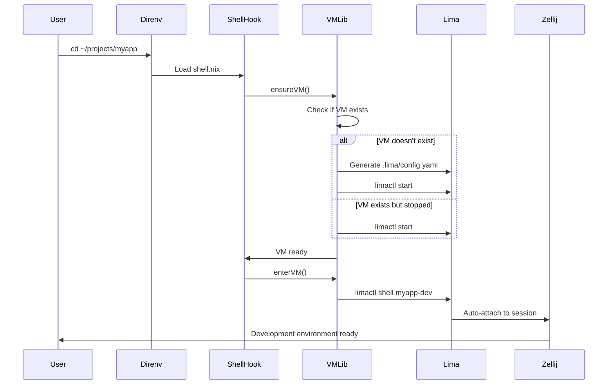

# PRD-05: Project-Scoped VM Management

## Overview

Create automatic project-scoped Lima VM management via Nix flake templates and direnv hooks. When entering a project directory, direnv automatically creates, starts, and connects to a dedicated Lima VM with zero manual intervention.

## Problem Statement

After PRD-04, we can create Lima VMs manually, but the workflow is cumbersome:
- Must manually create Lima YAML configs
- Must remember VM names
- No standardized project structure
- No automation for common tasks
- Hard to discover which projects have VMs
- Context switching between host and VM requires conscious effort

## Proposed Solution

Implement automatic VM management via direnv + shell.nix:
- Nix flake templates provide project scaffolding (`nix flake init -t github:user/sysinit#vm-dev`)
- shell.nix contains VM lifecycle hooks
- direnv detects project entry and triggers hooks automatically
- VM auto-creates on first `cd`, auto-starts if stopped, auto-enters with Zellij
- Zero manual commands for normal workflow
- Optional manual controls via Taskfile for power users

## Scope

### In Scope
- Nix flake templates for projects (vm-dev, vm-minimal)
- VM shell library (`lib/vm-shell.nix`) with lifecycle functions
- Lima template directory structure
- Enhanced direnv configuration with VM detection
- Taskfile integration for manual control
- Documentation and migration guide

### Out of Scope
- Minimal host implementation (handled in PRD-06)
- Advanced Lima features (snapshots, cloning)
- Multi-VM orchestration
- CI/CD integration
- Docker-in-VM support

## Technical Design

### Architecture Flow



### File Structure

```
# Sysinit repo structure:
lib/
└── vm-shell.nix           # VM management library functions

templates/
├── vm-dev/
│   ├── shell.nix          # Full dev environment
│   ├── .envrc             # direnv: use nix
│   ├── flake.nix          # Optional: flake-based template
│   └── .gitignore         # Ignore .direnv/, .lima/
├── vm-minimal/
│   ├── shell.nix          # Minimal environment
│   ├── .envrc
│   └── .gitignore
└── vm-custom/
    ├── shell.nix          # Customizable template
    ├── .envrc
    └── README.md          # Instructions

lima/
├── templates/
│   ├── project-base.yaml  # Template for .lima/config.yaml
│   ├── dev.yaml           # Reference full dev config
│   └── minimal.yaml       # Reference minimal config
└── README.md

# In each project:
~/projects/myapp/
├── shell.nix              # From template, customizable
├── .envrc                 # direnv allow required
├── .lima/
│   └── config.yaml        # Generated, gitignored
└── .gitignore             # Includes .direnv/, .lima/
```

### VM Shell Library

```nix
# lib/vm-shell.nix
{ pkgs, lib, ... }:

let
  inherit (lib) escapeShellArg;
  
  limactl = "${pkgs.lima}/bin/limactl";
  
in rec {
  # Generate Lima config from parameters
  generateLimaConfig = { projectName, projectDir, image ? "lima-dev", cpus ? 4, memory ? "8GiB", disk ? "50GiB", ports ? [3000 8080 5173] }:
    let
      portForwards = lib.concatMapStrings (port: ''
        - guestPort: ${toString port}
          hostPort: ${toString port}
      '') ports;
    in ''
      vmType: "vz"
      os: "Linux"
      arch: "aarch64"
      
      cpus: ${toString cpus}
      memory: "${memory}"
      disk: "${disk}"
      
      images:
        - location: "~/.lima/_images/sysinit-${image}-latest.qcow2"
          arch: "aarch64"
      
      mounts:
        - location: "~/.ssh"
          writable: false
        - location: "${projectDir}"
          writable: true
          9p:
            securityModel: "none"
            cache: "mmap"
      
      env:
        PROJECT_NAME: "${projectName}"
        ZELLIJ_SESSION: "${projectName}"
      
      portForwards:
      ${portForwards}
      
      ssh:
        localPort: 0
        loadDotSSHPubKeys: true
      
      provision:
        - mode: system
          script: |
            #!/bin/sh
            set -eux
            echo "Lima VM provisioned for ${projectName}"
      
      probes:
        - description: "SSH is ready"
          script: |
            #!/bin/bash
            ssh -o ConnectTimeout=3 127.0.0.1 true
    '';
  
  # Check if VM exists
  vmExists = vmName: ''
    if ${limactl} list --json | ${pkgs.jq}/bin/jq -e '.[] | select(.name == "${vmName}")' > /dev/null 2>&1; then
      true
    else
      false
    fi
  '';
  
  # Check if VM is running
  vmRunning = vmName: ''
    if ${limactl} list --json | ${pkgs.jq}/bin/jq -e '.[] | select(.name == "${vmName}" and .status == "Running")' > /dev/null 2>&1; then
      true
    else
      false
    fi
  '';
  
  # Ensure VM exists and is running
  ensureVM = { vmName, projectName, projectDir ? "$(pwd)", image ? "lima-dev", cpus ? 4, memory ? "8GiB", disk ? "50GiB", ports ? [3000 8080 5173], verbose ? true }: ''
    _vm_name="${vmName}"
    _project_dir="${projectDir}"
    _lima_dir="$_project_dir/.lima"
    _lima_config="$_lima_dir/config.yaml"
    
    # Create .lima directory if it doesn't exist
    if [[ ! -d "$_lima_dir" ]]; then
      ${lib.optionalString verbose ''echo "Creating .lima directory..."''}
      mkdir -p "$_lima_dir"
      
      # Create .gitignore
      cat > "$_lima_dir/.gitignore" <<'EOF'
# Lima VM state files
*.sock
*.pid
ha.log
serial.log
EOF
    fi
    
    # Generate Lima config if it doesn't exist
    if [[ ! -f "$_lima_config" ]]; then
      ${lib.optionalString verbose ''echo "Generating Lima VM configuration..."''}
      cat > "$_lima_config" <<'EOF'
${generateLimaConfig { inherit projectName projectDir image cpus memory disk ports; }}
EOF
      # Substitute actual project directory (handle tilde expansion)
      sed -i.bak "s|${projectDir}|$_project_dir|g" "$_lima_config"
      rm "$_lima_config.bak"
    fi
    
    # Check if VM exists
    if ! ${vmExists vmName}; then
      ${lib.optionalString verbose ''echo "Creating VM: $_vm_name..."''}
      ${limactl} start --name="$_vm_name" --tty=false "$_lima_config"
    elif ! ${vmRunning vmName}; then
      ${lib.optionalString verbose ''echo "Starting VM: $_vm_name..."''}
      ${limactl} start "$_vm_name"
    else
      ${lib.optionalString verbose ''echo "VM already running: $_vm_name"''}
    fi
  '';
  
  # Enter VM with auto-attach to Zellij
  enterVM = vmName: projectName: verbose: ''
    _vm_name="${vmName}"
    
    ${lib.optionalString verbose ''echo "Connecting to $_vm_name (Zellij will auto-attach)..."''}
    
    export ZELLIJ_SESSION="${projectName}"
    export SYSINIT_IN_VM=1
    
    # Check if already in a VM
    if [[ -n "''${SYSINIT_IN_VM:-}" ]]; then
      echo "Already in VM session. Exit first before entering another VM."
      return 1
    fi
    
    exec ${limactl} shell "$_vm_name"
  '';
  
  # Stop VM
  stopVM = vmName: verbose: ''
    ${lib.optionalString verbose ''echo "Stopping VM: ${vmName}..."''}
    ${limactl} stop "${vmName}"
  '';
  
  # Destroy VM
  destroyVM = vmName: verbose: ''
    ${lib.optionalString verbose ''echo "Destroying VM: ${vmName}..."''}
    ${limactl} stop "${vmName}" 2>/dev/null || true
    ${limactl} delete "${vmName}"
  '';
  
  # Get VM status
  vmStatus = vmName: ''
    ${limactl} list | grep -E "(NAME|^${vmName})" || echo "VM not found: ${vmName}"
  '';
}
```

### Template: vm-dev/shell.nix

```nix
# templates/vm-dev/shell.nix
{ pkgs ? import <nixpkgs> {} }:

let
  # Fetch VM library from sysinit repo
  vmLib = import (pkgs.fetchFromGitHub {
    owner = "roshbhatia";
    repo = "sysinit";
    rev = "main";  # Or pin to specific commit
    sha256 = "0000000000000000000000000000000000000000000000000000";  # Update after first push
  } + "/lib/vm-shell.nix") { inherit pkgs; inherit (pkgs) lib; };
  
  projectName = builtins.baseNameOf (builtins.toString ./.);
  vmName = "${projectName}-dev";
  
in
pkgs.mkShell {
  name = "${projectName}-dev-shell";
  
  # Project dependencies (available in VM)
  buildInputs = with pkgs; [
    # Add your project-specific dependencies here
    # These are just for nix-shell metadata
  ];
  
  shellHook = ''
    # Prevent nested VM entry
    if [[ -n "''${SYSINIT_IN_VM:-}" ]]; then
      echo "Already in VM. Skipping auto-entry."
      return 0
    fi
    
    # Disable auto-entry if requested
    if [[ -n "''${SYSINIT_NO_AUTO_VM:-}" ]]; then
      echo "Auto VM entry disabled. Run 'task lima:shell' to connect manually."
      return 0
    fi
    
    # Ensure VM exists and is running
    ${vmLib.ensureVM {
      inherit vmName projectName;
      projectDir = "$(pwd)";
      image = "lima-dev";
      cpus = 4;
      memory = "8GiB";
      ports = [3000 8080 5173 5432];  # Customize as needed
      verbose = true;
    }}
    
    # Auto-enter VM
    ${vmLib.enterVM vmName projectName true}
  '';
}
```

### Template: vm-dev/.envrc

```bash
# templates/vm-dev/.envrc
use nix

# Optional: Set VM configuration overrides
# export SYSINIT_NO_AUTO_VM=1  # Disable auto-entry
# export VM_CPUS=8
# export VM_MEMORY="16GiB"
```

### Template: vm-dev/.gitignore

```
# Direnv
.direnv/

# Lima VM
.lima/

# Nix
result
result-*
```

### Template: vm-dev/flake.nix (optional)

```nix
# templates/vm-dev/flake.nix
{
  description = "Development project with Lima VM";

  inputs = {
    nixpkgs.url = "github:NixOS/nixpkgs/nixpkgs-unstable";
    sysinit.url = "github:roshbhatia/sysinit";
  };

  outputs = { self, nixpkgs, sysinit }:
    let
      system = "aarch64-darwin";
      pkgs = nixpkgs.legacyPackages.${system};
    in
    {
      devShells.${system}.default = import ./shell.nix { inherit pkgs; };
    };
}
```

### Flake Outputs Integration

```nix
# flake/outputs.nix (additions)
{
  # ... existing outputs ...
  
  templates = {
    vm-dev = {
      path = ./templates/vm-dev;
      description = "Full development project with automatic Lima VM integration";
      welcomeText = ''
        # Development project created!
        
        ## Setup
        1. Review shell.nix and customize VM settings
        2. Run: direnv allow
        3. The VM will auto-create and you'll be dropped into it
        
        ## Manual controls
        - Stop VM: task lima:stop
        - Destroy VM: task lima:destroy
        - Status: task lima:status
        
        ## Disable auto-entry
        Set SYSINIT_NO_AUTO_VM=1 in .envrc to disable automatic VM entry.
      '';
    };
    
    vm-minimal = {
      path = ./templates/vm-minimal;
      description = "Minimal project with basic Lima VM";
      welcomeText = ''
        # Minimal project created!
        
        Run 'direnv allow' to enable automatic VM management.
      '';
    };
  };
}
```

### Enhanced Direnv Configuration

```nix
# modules/home/configurations/direnv.nix
{ pkgs, ... }:

{
  programs.direnv = {
    enable = true;
    enableZshIntegration = true;
    nix-direnv.enable = true;
    
    stdlib = ''
      # VM detection and helpers
      export_function() {
        eval "''${1}() { ''${2} ; }"
      }
      
      # Detect VM configuration
      vm_detect() {
        if [[ -f .lima/config.yaml ]]; then
          export SYSINIT_VM_ENABLED=1
          export SYSINIT_VM_NAME="$(basename "$PWD")-dev"
          
          # Add VM helper functions
          export_function vm-shell "${pkgs.lima}/bin/limactl shell \$SYSINIT_VM_NAME"
          export_function vm-stop "${pkgs.lima}/bin/limactl stop \$SYSINIT_VM_NAME"
          export_function vm-status "${pkgs.lima}/bin/limactl list | grep \$SYSINIT_VM_NAME"
        fi
      }
      
      # Auto-run VM detection on load
      watch_file .lima/config.yaml
    '';
  };
}
```

### Taskfile Integration

```yaml
# Taskfile.yml additions
tasks:
  # Lima VM commands (manual control)
  lima:init:
    desc: Initialize Lima VM config for current project
    cmds:
      - nix flake init -t github:roshbhatia/sysinit#vm-dev
      - direnv allow
  
  lima:shell:
    desc: Connect to project Lima VM (manual)
    cmds:
      - limactl shell "$(basename $PWD)-dev"
  
  lima:start:
    desc: Start project Lima VM without entering
    cmds:
      - limactl start "$(basename $PWD)-dev"
  
  lima:stop:
    desc: Stop project Lima VM
    cmds:
      - limactl stop "$(basename $PWD)-dev"
  
  lima:status:
    desc: Show project Lima VM status
    cmds:
      - limactl list | grep "$(basename $PWD)-dev" || echo "VM not found"
  
  lima:destroy:
    desc: Destroy project Lima VM
    cmds:
      - limactl delete "$(basename $PWD)-dev"
  
  lima:rebuild:
    desc: Rebuild Lima dev image
    cmds:
      - ./hack/build-lima-image lima-dev
```

## Acceptance Criteria

All criteria must pass for PRD completion.

**File Structure**
- `lib/vm-shell.nix` exists with all lifecycle functions
- `templates/vm-dev/` directory with shell.nix, .envrc, .gitignore, flake.nix
- `templates/vm-minimal/` directory with minimal shell.nix
- `lima/templates/project-base.yaml` template exists
- Flake outputs include `templates.vm-dev` and `templates.vm-minimal`

**VM Library Functionality**
- `generateLimaConfig` creates valid Lima YAML
- `vmExists` correctly detects VM presence
- `vmRunning` correctly detects VM state
- `ensureVM` creates VM on first run, starts if stopped
- `enterVM` connects to VM with Zellij auto-attach
- `stopVM` and `destroyVM` work correctly

**Template Functionality**
- `nix flake init -t github:user/sysinit#vm-dev` creates project structure
- Generated shell.nix is valid and evaluates
- shell.nix shellHook calls VM library functions correctly
- .envrc contains `use nix`
- .gitignore excludes .direnv/ and .lima/

**Direnv Integration**
- Enhanced direnv config includes VM detection stdlib
- `direnv allow` in project triggers shell.nix hooks
- VM auto-creates on first `cd` into project
- VM auto-starts if stopped
- VM auto-entry happens (exec into limactl shell)
- Environment variable `SYSINIT_IN_VM` prevents nesting

**Workflow Tests**

New project from template:
- Run `nix flake init -t github:user/sysinit#vm-dev` in empty directory
- Files created: shell.nix, .envrc, .gitignore, flake.nix
- Run `direnv allow`
- VM auto-creates with name `<dirname>-dev`
- Dropped into VM shell with Zellij
- Inside VM: project directory mounted
- Inside VM: can create files that appear on host
- Exit VM, cd back in → auto-reconnects to same Zellij session

Manual control:
- `task lima:stop` stops VM
- `task lima:status` shows VM stopped
- cd into project → VM auto-starts, auto-enters
- `task lima:destroy` removes VM
- cd into project → VM recreates from scratch

Escape hatches:
- Set `SYSINIT_NO_AUTO_VM=1` in .envrc
- direnv allow
- cd into project → shell.nix loads but no VM entry
- Helper functions available: `vm-shell`, `vm-stop`, `vm-status`

Multiple projects:
- Create 3 projects from template
- Each gets own VM: `proj1-dev`, `proj2-dev`, `proj3-dev`
- Can switch between projects
- Each maintains own Zellij session
- No interference between VMs

**Build Validation**
- `nix flake check` passes with templates
- `nix eval .#templates.vm-dev` succeeds
- `nix flake show` displays templates

## Testing Procedure

### Pre-Flight Checks

```bash
# Ensure Lima images built
ls -lh ~/.lima/_images/sysinit-lima-dev-latest.qcow2

# Ensure direnv working
direnv --version

# Create test directory
mkdir -p ~/projects/prd05-test
```

### Template Creation Test

```bash
cd ~/projects
mkdir test-vm-template && cd test-vm-template

# Initialize from template
nix flake init -t github:roshbhatia/sysinit#vm-dev

# Verify files created
test -f shell.nix
test -f .envrc
test -f .gitignore
test -f flake.nix

# Check shell.nix is valid
nix-instantiate shell.nix

# Allow direnv (this should trigger VM creation)
direnv allow

# Should now be inside VM
# Test VM environment:
whoami          # Should be: dev
pwd             # Should be in project directory
which nvim      # Should be found
echo "test" > test.txt

# Exit VM
exit

# Back on host - verify file
cat test.txt    # Should show: test

# Re-enter project
cd ..; cd test-vm-template
# Should auto-reconnect to VM
```

### Multiple Projects Test

```bash
cd ~/projects

# Create 3 projects
for i in 1 2 3; do
  mkdir multi-$i && cd multi-$i
  nix flake init -t github:roshbhatia/sysinit#vm-dev
  # Don't direnv allow yet
  cd ..
done

# Enable all at once
for i in 1 2 3; do
  cd multi-$i
  direnv allow &
  cd ..
done

# Wait for all VMs to start
wait

# Verify all running
limactl list | grep multi-
# Should show: multi-1-dev, multi-2-dev, multi-3-dev

# Test switching
cd multi-1  # Should enter multi-1-dev VM
exit
cd multi-2  # Should enter multi-2-dev VM
exit

# Cleanup
for i in 1 2 3; do
  cd ~/projects/multi-$i
  task lima:destroy
  cd ..
  rm -rf multi-$i
done
```

### Escape Hatch Test

```bash
cd ~/projects
mkdir escape-test && cd escape-test
nix flake init -t github:roshbhatia/sysinit#vm-dev

# Add escape hatch to .envrc
echo 'export SYSINIT_NO_AUTO_VM=1' >> .envrc

direnv allow

# Should NOT enter VM, but shell.nix should load
# Test helper functions available:
vm-status       # Should show VM created but can run manually
vm-shell        # Manually enter VM
exit

# Remove escape hatch
sed -i '/SYSINIT_NO_AUTO_VM/d' .envrc
direnv allow    # Should now auto-enter
```

### Library Function Test

```bash
# Test VM library functions directly
nix-instantiate --eval -E '
  let
    pkgs = import <nixpkgs> {};
    vmLib = import ./lib/vm-shell.nix { inherit pkgs; inherit (pkgs) lib; };
  in
  {
    hasEnsureVM = builtins.isFunction vmLib.ensureVM;
    hasEnterVM = builtins.isFunction vmLib.enterVM;
    hasGenerateConfig = builtins.isFunction vmLib.generateLimaConfig;
  }
'
# Should output: { hasEnsureVM = true; hasEnterVM = true; hasGenerateConfig = true; }
```

## Rollback Plan

### If Template Doesn't Work

```bash
# Remove flake template outputs
# Edit flake/outputs.nix, comment out templates section
# Rebuild flake

# Fallback: Manually create shell.nix in projects
```

### If VM Auto-Entry Breaks Shell

```bash
# In broken project:
echo 'export SYSINIT_NO_AUTO_VM=1' >> .envrc
direnv allow

# Or disable direnv entirely:
direnv deny

# Fix VM library, test, then re-enable
```

### If VM Library Has Bugs

```bash
# Pin to known-good commit in shell.nix:
# Change 'rev = "main"' to specific commit hash

# Or vendor the library:
cp lib/vm-shell.nix ~/projects/myapp/
# Update shell.nix to import ./vm-shell.nix
```

### Full Rollback

```bash
# Remove all test VMs
limactl list | tail -n +2 | awk '{print $1}' | xargs -n1 limactl delete -f

# Revert code
git revert HEAD

# Clean up test projects
rm -rf ~/projects/test-*
rm -rf ~/projects/multi-*
```

## Dependencies

**Blocks**: PRD-06
**Blocked By**: PRD-01, PRD-03, PRD-04

Requires profiles, Lima foundation, and Ghostty+Zellij. This PRD provides the automatic tooling that makes the minimal host practical.

## Migration Guide

### New Projects

```bash
cd ~/projects
nix flake new myapp -t github:roshbhatia/sysinit#vm-dev
cd myapp
# Auto-enters VM, ready to code!
```

### Existing Projects

```bash
cd ~/projects/existing-app
nix flake init -t github:roshbhatia/sysinit#vm-dev
direnv allow
# VM created, auto-entered, existing files available
```

### Customizing VM Settings

Edit `shell.nix`:
```nix
${vmLib.ensureVM {
  inherit vmName projectName;
  cpus = 8;              # More CPU
  memory = "16GiB";      # More RAM
  ports = [3000 8080];   # Custom ports
  verbose = false;       # Quiet mode
}}
```

### Sharing with Team

Commit `shell.nix`, `.envrc`, and `.gitignore`:
```bash
git add shell.nix .envrc .gitignore
git commit -m "Add Lima VM development environment"
git push
```

Teammates just need:
```bash
git clone <repo>
cd <repo>
direnv allow  # Auto-creates their own VM
```

## Notes

- VM configs generated locally, not committed (`.lima/` in .gitignore)
- Each developer gets their own VM instance
- shell.nix is committed, shareable, customizable
- Can override settings via environment variables in .envrc
- VMs persist between restarts (not ephemeral)
- Nested VM protection via `SYSINIT_IN_VM` env var
- Can still use manual Taskfile commands for power users
- Library fetched from GitHub, version-pinnable
- Future: Could vendor library or use Nix flake input instead of fetchFromGitHub
