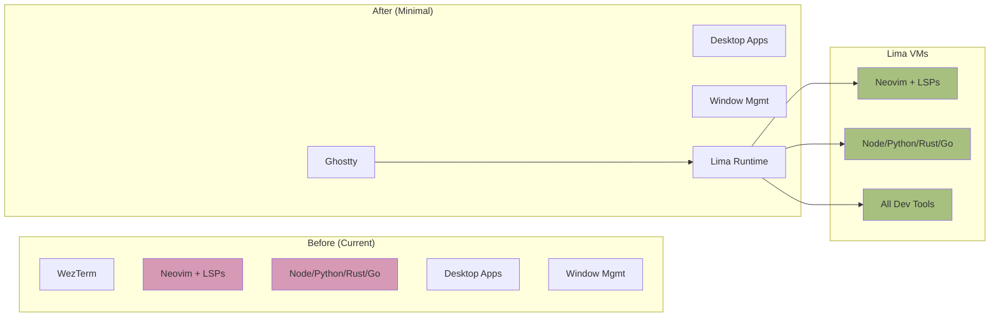

# PRD-06: Minimal Host

## Overview

Strip the macOS host (lv426) down to essentials, removing all development tools and keeping only desktop applications, window management, and Ghostty terminal for connecting to Lima VMs.

## Problem Statement

Currently lv426 has:
- Full development environment (neovim, language runtimes, LSPs)
- 200+ packages installed
- Dev toolchains that may conflict
- Heavy resource usage
- Maintenance burden

After PRD-05, all development happens in Lima VMs, so these tools are redundant on the host.

## Proposed Solution

Update lv426 to use the `host-minimal` profile, which contains only:
- Ghostty terminal
- Desktop apps (Firefox, Discord)
- Window management (Aerospace, Borders, Sketchybar)
- Essential CLI tools (git for managing dotfiles, ripgrep, fd, bat)
- Lima runtime

All development tools move exclusively to Lima VMs.

## Scope

### In Scope
- Update lv426 configuration to use host-minimal profile
- Remove WezTerm configuration
- Remove neovim from host
- Remove language runtimes from host (node, python, rust, go)
- Remove LSPs and dev toolchains
- Keep minimal shell for host operations
- Keep git for dotfiles management
- Documentation of new workflow

### Out of Scope
- Removing desktop apps
- Removing window management
- Removing theme system
- Changes to arrakis configuration

## Technical Design

### Before vs After



### Updated lv426 Configuration

```nix
# flake/hosts.nix
lv426 = {
  system = "aarch64-darwin";
  platform = "darwin";
  inherit (common) username;
  
  # Use minimal profile (not full dev environment)
  profile = "host-minimal";
  
  values = common.values // {
    theme = {
      colorscheme = "everforest";
      variant = "dark-soft";
    };
    darwin.homebrew.additionalPackages.casks = [
      "discord"
      "steam"
      # Any other GUI apps
    ];
  };
};
```

### host-minimal Profile

```nix
# profiles/host-minimal.nix
{ pkgs, ... }:

{
  imports = [
    ./base.nix           # Nix settings
    ./desktop.nix        # Desktop apps, window management
  ];
  
  # Lima for VM management
  environment.systemPackages = with pkgs; [
    lima
  ];
  
  # Minimal home-manager
  home-manager.users.rshnbhatia = {
    imports = [
      # Terminal
      ../modules/desktop/home/ghostty
      
      # Desktop apps
      ../modules/desktop/home/firefox
      
      # Minimal shell for host operations
      ../modules/dev/home/shell/zsh
      
      # Git for managing dotfiles ONLY
      ../modules/dev/home/vcs/git
      
      # NO neovim, NO helix
      # NO language runtimes
      # NO LSPs
    ];
    
    # Essential CLI tools for host operations
    home.packages = with pkgs; [
      # File operations
      ripgrep    # Fast search
      fd         # Fast find
      bat        # Better cat
      eza        # Better ls
      
      # System tools
      htop       # Process monitor
      
      # Git (for dotfiles)
      gh         # GitHub CLI
    ];
  };
}
```

### Workflow Changes

**Old workflow (all on host):**
```bash
cd ~/projects/myapp
nvim src/main.py              # Edit on host
npm install                   # Install on host
npm run dev                   # Run on host
```

**New workflow (dev in VM):**
```bash
cd ~/projects/myapp
sysinit-vm init               # One-time setup
sysinit-vm shell              # Enter VM (auto-attach Zellij)

# Now in VM:
nvim src/main.py              # Edit in VM
npm install                   # Install in VM
npm run dev                   # Run in VM

# Ctrl+A D to detach
# Files synced to host automatically
```

### Migration Checklist

Before applying:
- Ensure all active projects have VMs set up
- Verify Lima images built (lima-dev, lima-minimal)
- Test sysinit-vm CLI works
- Backup current generation
- Create Time Machine snapshot

After applying:
- Verify Ghostty launches
- Verify desktop apps work
- Verify can create and connect to VMs
- Verify neovim NOT on host: `which nvim` returns nothing
- Verify neovim IN VM: works correctly

## Acceptance Criteria

All criteria must pass for PRD completion.

**Configuration Changes**
- lv426 uses `host-minimal` profile in flake/hosts.nix
- `profiles/host-minimal.nix` imports only desktop and base
- No dev tool modules imported in host-minimal
- No language runtimes in host packages

**Build Validation**
- `task nix:validate` passes
- `nix flake check` succeeds
- `task nix:build:lv426` succeeds
- Build shows packages being REMOVED (expected)
- No unexpected packages removed (only dev tools)

**System Functionality After Apply**
- `task nix:refresh:lv426` applies successfully
- System boots normally
- Ghostty launches
- Firefox launches with correct theme
- Discord launches
- Aerospace keybindings work
- Sketchybar displays correctly
- Borders visible on windows
- Shell works (can navigate, run commands)

**Host Verification (what's GONE)**
- `which nvim` returns nothing (not found)
- `which node` returns nothing (not found)
- `which python3` returns nothing OR shows system python only
- `which rustc` returns nothing (not found)
- `which cargo` returns nothing (not found)
- `which go` returns nothing (not found)
- WezTerm not in Applications (or not default)

**Host Verification (what's PRESENT)**
- `which git` found (for dotfiles)
- `which rg` found (ripgrep)
- `which fd` found
- `which bat` found
- `which eza` found
- `which htop` found
- `which gh` found (GitHub CLI)
- `sysinit-vm --help` works

**VM Development Workflow**
- Create new test project
- Run `sysinit-vm init && sysinit-vm start`
- Run `sysinit-vm shell`
- Inside VM: `which nvim` found
- Inside VM: `which node` found
- Inside VM: `nvim test.py` works
- Inside VM: `node --version` works
- Create file in VM, appears on host
- Detach and reattach works

**Package Count**
- Host has < 100 packages (down from 200+)
- VM has 200+ packages (all dev tools)

**Resource Usage**
- macOS host memory usage lower
- Disk space freed on host
- VM uses resources only when running

## Testing

### Pre-Flight Checks

```bash
# Current generation
darwin-rebuild --list-generations | head -3

# Current package count
nix-store -q --references /run/current-system/sw | wc -l

# Create backup
sudo tmutil localsnapshot /

# Tag current state
git tag pre-minimal-host
```

### Build Test

```bash
# Build new config
task nix:build:lv426

# Compare package changes
nix-store diff-closures /run/current-system ./result | head -50

# Verify dev tools will be removed
nix-store diff-closures /run/current-system ./result | grep -E "neovim|nodejs|python|rust"
# Should show negative sizes (removal)
```

### Apply Test

```bash
# Apply configuration
task nix:refresh:lv426

# Wait for rebuild to complete
# System may feel "lighter"

# Verify desktop works
open -a Ghostty     # Should launch
open -a Firefox     # Should launch
open -a Discord     # Should launch

# Test Aerospace
# Press your Aerospace keybindings
# Windows should move

# Verify dev tools removed
which nvim          # Should return nothing
which node          # Should return nothing
which rustc         # Should return nothing

# Verify essential tools present
which git           # Found
which rg            # Found
which sysinit-vm    # Found
```

### VM Workflow Test

```bash
# Create test project
mkdir -p ~/projects/minimal-host-test
cd ~/projects/minimal-host-test

# Setup VM
sysinit-vm init dev
sysinit-vm start

# Connect
sysinit-vm shell

# Inside VM - verify dev tools
which nvim          # Found
which node          # Found
which python3       # Found
nvim --version      # Works
node --version      # Works

# Test file sync
echo "console.log('test')" > test.js
node test.js        # Should output: test
# Ctrl+A D to detach
exit

# On host - verify file
cat ~/projects/minimal-host-test/test.js  # Should show content

# Reattach
sysinit-vm shell
# Should work

# Cleanup
exit
sysinit-vm destroy
cd ~ && rm -rf ~/projects/minimal-host-test
```

### Package Count Verification

```bash
# Host package count
nix-store -q --references /run/current-system/sw | wc -l
# Should be < 100

# VM package count (connect to any VM)
limactl shell <vm-name>
nix-store -q --references /run/current-system/sw | wc -l
# Should be 200+
exit
```

### Migration Verification for Existing Projects

```bash
# If you have existing projects, test each:
cd ~/projects/my-real-project

# Setup VM
sysinit-vm init dev
sysinit-vm start
sysinit-vm shell

# Inside VM:
# Test your normal workflow
# - Can you edit files?
# - Can you run tests?
# - Can you build?
# - Can you run dev server?

# If all works, project successfully migrated
```

## Rollback

### If Desktop Breaks

```bash
# Rollback to previous generation
sudo darwin-rebuild --rollback

# OR
darwin-rebuild switch --rollback

# Verify desktop works again
```

### If Shell is Broken

```bash
# From recovery or another terminal:
sudo darwin-rebuild --rollback

# OR use Time Machine
# Boot to recovery, restore from snapshot
```

### If VM Workflow Doesn't Work

```bash
# Don't rollback host - fix VM instead
# Check Lima VM status
limactl list

# Check VM logs
cat ~/.lima/<vm-name>/ha.log

# Rebuild VM image
./hack/build-lima-image lima-dev

# Recreate project VM
cd ~/projects/<project>
sysinit-vm destroy
sysinit-vm init
sysinit-vm start
```

### Git Rollback

```bash
# Revert code changes
git reset --hard pre-minimal-host

# Rebuild
task nix:refresh:lv426
```

## Dependencies

**Blocks**: None (final PRD)
**Blocked By**: PRD-01, PRD-02, PRD-05

Requires profile system, module options, and project VMs to be in place. This is the culmination of all previous work.

## Migration Guide

### For New Projects

1. Create project directory
2. Run `sysinit-vm init`
3. Run `sysinit-vm start`
4. Run `sysinit-vm shell`
5. Develop inside VM

### For Existing Projects

For each existing project:

1. Ensure changes committed/backed up
2. `cd ~/projects/<project>`
3. `sysinit-vm init dev`
4. `sysinit-vm start`
5. `sysinit-vm shell`
6. Test your workflow (build, test, run)
7. If works: project migrated
8. If fails: check what's missing, add to VM or fix

### Common Issues

**Issue**: Missing global npm packages
**Fix**: Install in VM: `npm install -g <package>`

**Issue**: Can't run docker
**Fix**: Docker in VM not currently supported (future enhancement)

**Issue**: IDE on host can't find language servers
**Fix**: Use terminal-based editors in VM (nvim/helix) OR configure IDE to use VM's language servers over SSH

**Issue**: Need to run something on host
**Fix**: Install via homebrew: `brew install <package>`

## Post-Migration Cleanup

After successful migration and testing:

```bash
# Remove old WezTerm config (if not needed)
rm -rf ~/.config/wezterm

# Collect garbage to free space
nix-collect-garbage -d

# Clean up old generations (keep last 5)
sudo nix-collect-garbage --delete-older-than 30d

# Optimize nix store
nix-store --optimize
```

## Notes

- This is a one-way migration (can rollback, but moving forward)
- Keep host as clean as possible
- All dev work happens in VMs from now on
- VMs are disposable - can always recreate
- Host remains stable and maintainable
- Desktop experience unchanged
- Development workflow changed but improved (isolation)
- Can still use host for git operations, file browsing, etc.
- Lima VMs persist between restarts (not truly ephemeral)
- Can create throwaway VMs for experiments: `sysinit-vm init minimal`
