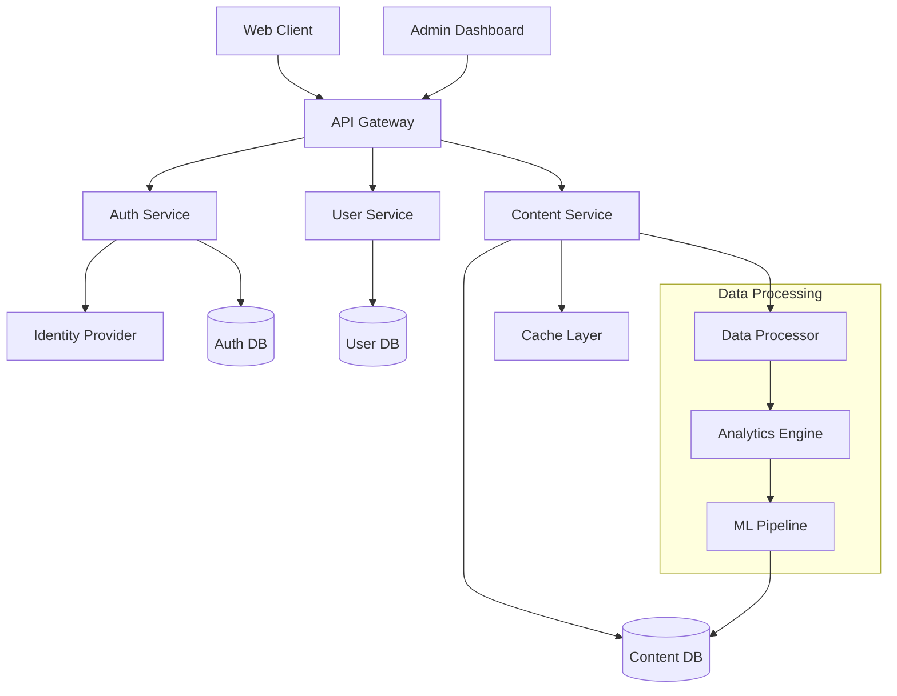

```mermaid
graph TD
    A[Web Client] --> B[API Gateway]
    B --> C[Auth Service]
    B --> D[User Service]
    B --> E[Content Service]

    D --> F[(User DB)]
    E --> G[(Content DB)]
    E --> H[Cache Layer]

    C --> I[Identity Provider]
    C --> J[(Auth DB)]

    K[Admin Dashboard] --> B

    subgraph Data Processing
    L[Data Processor]
    M[Analytics Engine]
    N[ML Pipeline]
    end

    E --> L
    L --> M
    M --> N
    N --> G
```
