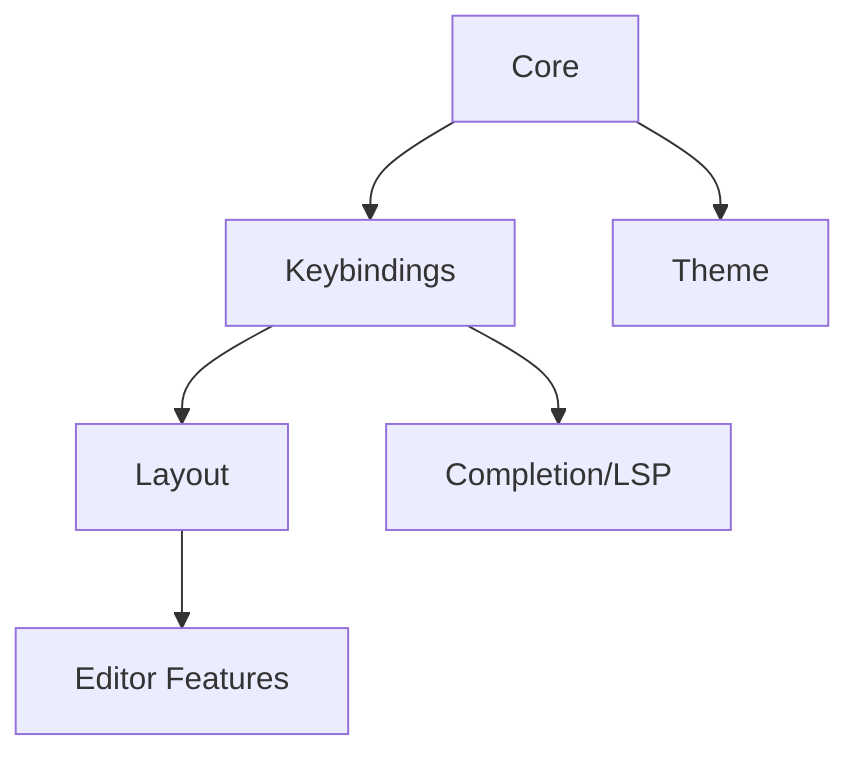

# Neovim Configuration Roadmap

## Migration Checklist

- [x] Core Module System
  - [x] Module Registration
  - [x] Plugin Management
  - [x] Test Framework
  - [x] Health Checks
  - [x] Verification System

- [x] Layout Module
  - [x] Panel System
  - [x] WezTerm Integration
  - [x] Tests & Verification

- [x] Theme Module
  - [x] Theme Management
  - [x] Tests & Verification
  - [ ] Color Scheme API
  - [ ] Theme Preview System

- [ ] Keybindings Module
  - [x] Legendary Integration
  - [x] Which-key Integration
  - [ ] Mode-specific Bindings
  - [ ] Context-aware Keymaps

- [ ] Completion & LSP
  - [ ] LSP Configuration
  - [ ] Completions Setup
  - [ ] Snippets Integration
  - [ ] Tests & Verification

- [ ] Editor Features
  - [ ] File Navigation
  - [ ] Search & Replace
  - [ ] Git Integration
  - [ ] Tests & Verification

## Module System Improvements Needed

1. **Dependency Resolution**
   - Implement proper dependency ordering
   - Handle circular dependencies
   - Lazy loading support

2. **State Management**
   - Module state persistence
   - Cross-module communication
   - Event system

3. **Testing Infrastructure**
   - Automated test runs
   - Coverage reporting
   - Performance benchmarks

## Plugin Analysis & Alternatives

| Current Plugin | Modern Alternative | Justification | Migration Priority |
|----------------|-------------------|---------------|-------------------|
| oil.nvim | mini.files | Lighter, faster, better maintained | Low |
| legendary.nvim | hydra.nvim | More modern approach to keymaps, better modal support | Medium |
| neominimap.nvim | aerial.nvim | Better code outline support, maintained | High |
| themery.nvim | appearances.nvim | Real-time preview, better API | Low |
| which-key.nvim | No change | Still best-in-class | N/A |

## Module Dependencies



## Chat Reset Information

If starting a fresh chat is needed, use this prompt:

```
The key words "MUST", "MUST NOT", "REQUIRED", "SHALL", "SHALL
NOT", "SHOULD", "SHOULD NOT", "RECOMMENDED",  "MAY", and
"OPTIONAL" in this document are to be interpreted as described in
RFC 2119.

You are a principal software engineer experienced in platform engineering and development tools.
  
I'm working on modularizing my Neovim config. Current structure:
- Core module system for plugin/test management
- Layout module for panel/window management
- Theme module for colorscheme management
- Keybinding module using legendary.nvim

Looking to:
1. Migrate remaining plugins to module system
2. Improve test coverage and verification
3. Implement proper dependency management

Current files:
/modules/home/neovim/

Please help continue the migration focusing on the individual tasks.

To be successful you:
- You MUST be concise.
- You SHOULD NOT include unneeded comments when adding or removing code.
- You MUST make incremental changes for units of functionality. 
- You SHOULD write code in a modular, extensible fashion using common deisgn patterns and prinicipals such as the open-close principal.
- You MUST ensure there's no breakages in existing functionality when making changes to APIs.
- You SHOULD ensure that code is tested, unless directed not to.
- You MUST wait for confirmation for me to validate the incremental changes.
```

## Architecture Decisions

1. **Panel System**
   - Use WezTerm for native integration
   - Support both floating and split layouts
   - Maintain state across buffer switches

2. **Testing Strategy**
   - Interactive verification
   - Health checks per module
   - Automated test cases

3. **Plugin Management**
   - Lazy loading by default
   - Module-specific plugin groups
   - Dependency tracking

## Performance Considerations

- [ ] Implement startup time measurements
- [ ] Add lazy loading where possible
- [ ] Profile memory usage per module
- [ ] Cache frequently used operations
